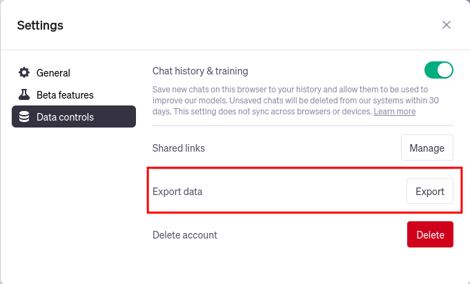

# chatgpt-conversations-to-markdown

Started as a thought for getting my conversations into Obisidian.

This is a simple script to transform your [ChatGPT](https://chat.openai.com/) conversations into [Markdown](https://www.markdownguide.org/).

## Usage

1. Export your ChatGPT conversations as a JSON file.
   
3. Create a virtual environment and install the dependencies:
    ```bash
    poetry env use 3.11
    source .venv/bin/activate
    poetry install
    ```
4. Run the script `python main.py --input-file=$CONVERSATION_JSON_PATH --output-directory=$OBSIDIAN_VAULT_PATH`

## Example

The `example` directory contains a JSON file and the corresponding Markdown file created from it.

```shell
poetry env use 3.11
source .venv/bin/activate
poetry install
python main.py --input-file=example/conversations-one.json --output-directory=example
```

- [conversations-one.json](./example/conversations-one.json)
- [Syncing ChatGPT with Obsidian](./example/Syncing%20ChatGPT%20with%20Obsidian.md)